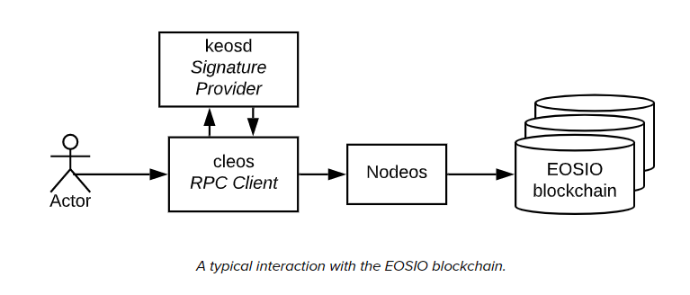
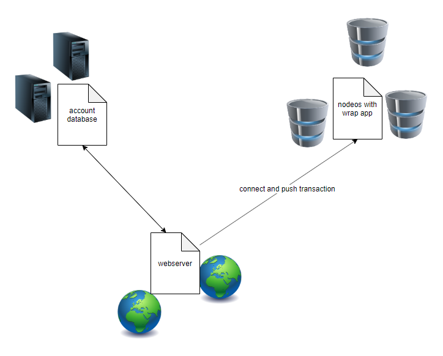

## 交易行的设计（法币）
----
**难点**
* 在不接支付宝等第三方平台API的情况下，如何处理作弊问题？
* 如何保证交易的可信性

**解决方案探讨**
1. 第一个方案
   

1. 让承兑商提供第三方支付接口，系统分支进行监控….

## 开发计划

主网站 = {数据库管理网站、历史币价采集网站、 网页提供网站（用户接口）、区块链交互端网站}

## union官网与区块链的交互

在区块链中，keosd，cleos，nodeos的关系如下图：

这三者关系的说明在eos探秘中有一些提及，这里不再赘述。类似的，我做出下面的设计来完成union与nodeos的交互：

webserver 相当于cleos， account database相当于keosd。

### Nodeos With Wrap

在运行nodeos的主机上会运行一个wrap程序用于直接与nodeos交互，交互方式是通过nodeos提供的<a href="https://developers.eos.io/eosio-nodeos/reference">rpc api</a>. wrap程序一方面实现connector的一些功能，另一方面要解密webserver的消息从而获取与nodeos交互的有效信息。

### Account DataBase

数据库服务部分是由多台主机构成，当然不会比webserver的主机多。每台主机都运行数据库服务，同时也有一个wrap，实现connector功能，还实现与webserver的交互。这个数据库主要保存了账号的私钥部分，当然保存方式是把私钥截断，并与很多无效数据进行混淆。只有webserver提供了可靠的信息，才能从浩如烟海的数据堆中拼凑出正确的私钥。因此，对Account Database的攻击是无效的。

### WebServer
用户登录到webserver后，要想使用钱包转账等功能，会被要求提供另一个账号和密码，该密码是在Account DataBase中找到正确信息的关键。一般的，webserver的常规数据库根据用户账号密码会保存一部分的Account Database中的私钥获取线索。另一部分需要用户输入。

例如，用户输入信息串 S + var  得到的结果hash得到了Account Database中的数据地址，当用户变更S时，可以任意的改变var而得到一个从没被使用过的新位置存放私钥。这就避免了直接用S表示私钥位置的尴尬，因为用户变更S到新值时很可能那个位置已经被别人占用了。当然，私钥很可能是被截断保存的，采用类似的方法可以做到，这里不再具体赘述。

从安全的角度，网络传输可以使用非对称加密，从而保证网络传输过程中的信息安全。只有在上述网络的节点本机上，密钥才可能会被从内存截获。但在保证相关各个环节主机可靠性的基础上，信息的安全性是得到保证的。即使某个节点被完全攻破，数据外泄，也不会产生财务安全问题，除非那些节点在网络上实时的运行时遭受‘监控’才会产生安全问题，但也只是局部的安全问题。

